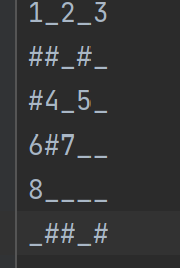
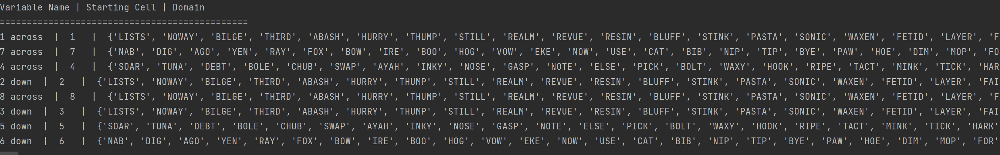
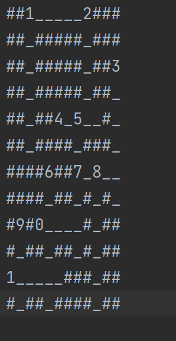
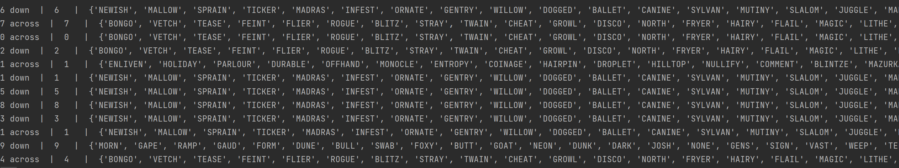
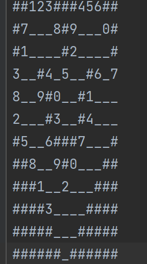
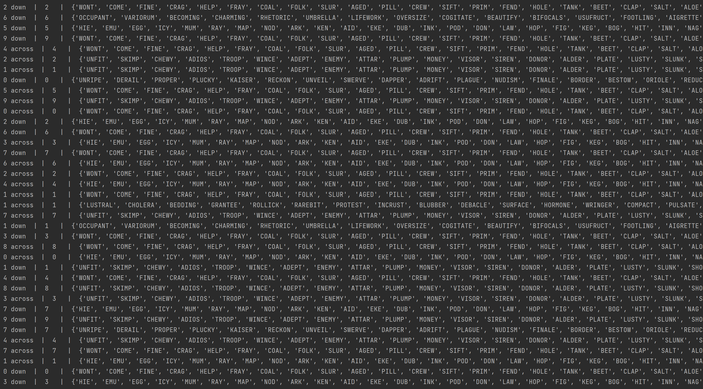

# Crosswords Project 3

## How to Run

Make sure the crossword and word files are in the data folder, then when the prompt appears
type the name of the file, for example when it says "Type the file name of the structure: " Type "struct.txt".  When it
asks for the word file type "simple_words.txt". 

For making the crossword file, use # to indicate walls and as this program uses .txt files, all
numbers are represented using (0,1,2,3,4,5,6,7,8,9) to indicate the start variables

## Results

This program runs at a O(n^2) as it uses recursive loops to collect the data. 

Easy Crossword, using all_words.txt

Results: 4923 Calls to backtracking Function, Using a total of 14412 Words

Normal Crossword, all words

Called 6547 times to backtracking Function, Using a total of 2832 Words

Hard Crossword, all words

Called 547 times using 11937 Words

Code Partially From: https://github.com/SriAmin/Harvard-CS50-AI-Projects/tree/main/crossword